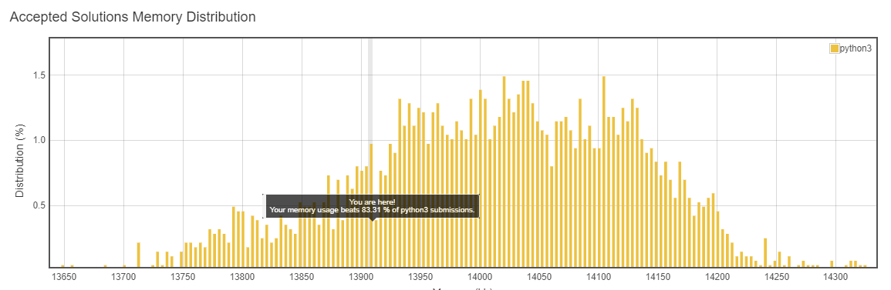
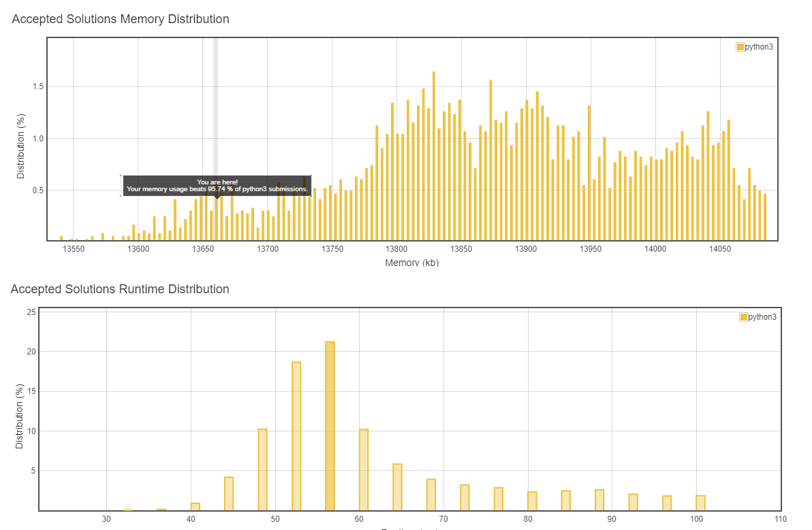
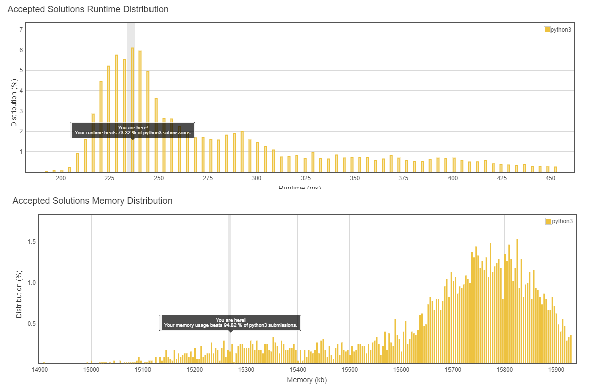
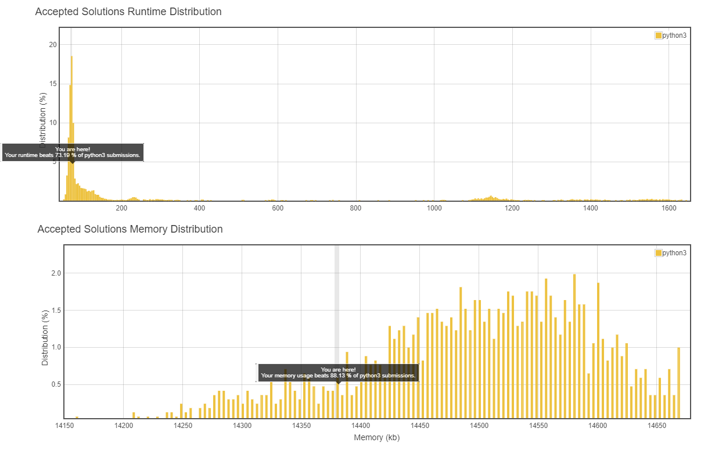
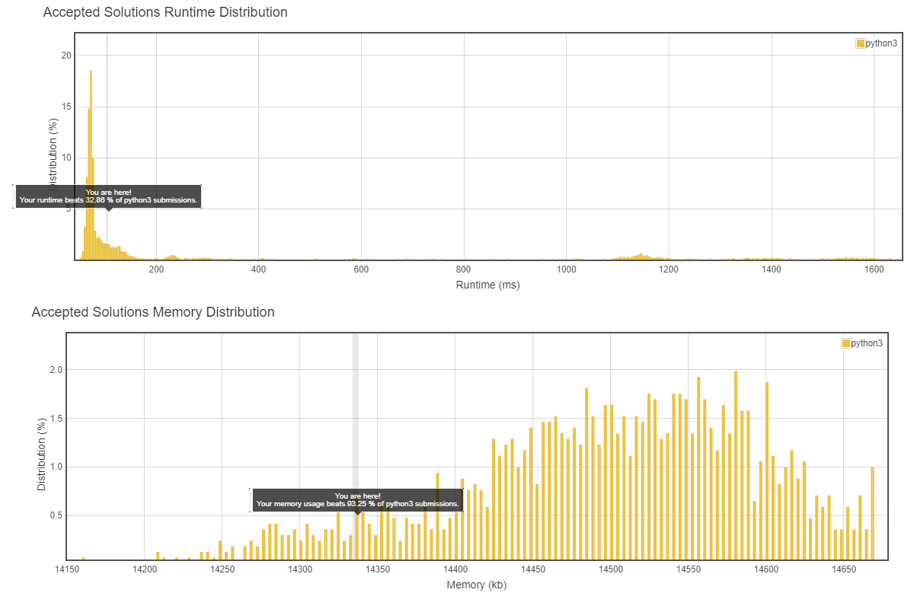

# Problem 1
Given a binary array, find the maximum number of consecutive 1s in this array.
* https://leetcode.com/explore/learn/card/fun-with-arrays/521/introduction/3238/


```python
class Solution:
    def findMaxConsecutiveOnes(self, nums: List[int]) -> int:
        j= k = -1  # start and end index of a seq of 1s
        max_len = 0 # len of the seq 
        
        for i in range(len(nums)):
            
            if nums[i] == 1:   
                if j == -1:    # Case1 : Started a seq
                    j=k=i      # init j and k 
                else:          # Case2 : within a seq 
                    k+=1       # increment k only 
            else:              # if seen a 0
                if j != -1:    # means counting a seq  
                    if k-j+1 > max_len: # Case3 : Terminates a Sequence 
                        max_len = k-j+1 # update the max_len if longer seq found
                    
                    j=k=-1     # reset to -1
        if j != -1:                     # Case4 : Default case : if list ends with 1
            if k-j+1 > max_len:
                max_len = k-j+1
        
        return max_len
```



# Problem 2: Find Numbers with Even Number of Digits
Given an array nums of integers, return how many of them contain an even number of digits.
* https://leetcode.com/explore/learn/card/fun-with-arrays/521/introduction/3237/

## Solution 1


```python
class Solution: 
    # O(1) soln: as everytime you compare with 5 ranges 
    def findNumbers(self, nums: List[int]) -> int:
        count = 0
        lim = 5    # input range [1..10^5]
        for n in nums:
            for i in range(lim+1):
                if n  >= 10**(i) and n < 10**(i+1): # which range the number resides
                    if (i+1)%2 == 0:
                        count+=1
        return count
```



## Solution 2


```python
class Solution:   
    def findNumbers(self, nums: List[int]) -> int:
        count = 0
        for n in nums:
            if( len( str(n) ) %2 == 0 ):
                count+=1
        return count
```

# Problem 3: Squares of a Sorted Array
Given an array of integers A sorted in non-decreasing order, return an array of the squares of each number, also in sorted non-decreasing order.
* https://leetcode.com/explore/learn/card/fun-with-arrays/521/introduction/3240/


```python
class Solution:
    def sortedSquares(self, A: List[int]) -> List[int]:
        for i in range(len(A)):
            A[i]= A[i]**2
        return sorted(A)
```



# problem 4: Duplicate Zeros
Given a fixed length array arr of integers, duplicate each occurrence of zero, shifting the remaining elements to the right.

Note that elements beyond the length of the original array are not written.

Do the above modifications to the input array in place, do not return anything from your function.

## Solution 1


```python
class Solution:
    def duplicateZeros(self, arr: List[int]) -> None:
        """
        Do not return anything, modify arr in-place instead.
        """
        f=-1
        c=0
        for i in range(len(arr)):
            if arr[i] == 0 and f != i:
                arr.insert(i+1,0)
                f = i+1
                c += 1
        while c:
            arr.pop(-1)
            c-=1
```



## Solution 2


```python
class Solution:
    def duplicateZeros(self, arr: List[int]) -> None:
        """
        Do not return anything, modify arr in-place instead.
        """
        f=-1
        for i in range(len(arr)):
            if arr[i] == 0 and f != i:
                arr.insert(i+1,0)
                arr.pop(-1)
                f = i+1
```




```python
x=[1,2]
y=[1]
a,b = len(x), len(y)
```


```python
a
```


    2


```python
b
```


    1


```python
sorted([1,2,3,2,5,6])
```


    [1, 2, 2, 3, 5, 6]


```python
nums1 = [1,2,3,0,0,0]
m = 3
nums2 = [2,5,6]
n = 3

i = m
j = 0
while i < m+n:
    nums1[i] = nums2[j]
    j+=1
    i+=1
nums1=sorted(nums1)
```


```python
nums1
```


    [1, 2, 2, 3, 5, 6]


```python
l = [1,2,3,2,5,6]
```


```python
list.sort(l)
```


```python
l
```


    [1, 2, 2, 3, 5, 6]


```python

```
